# Aula de Introdução ao Framework Bootstrap

<p align="center">
  <a href="#">
    
  </a>
  <a href="#">
    
  </a>
  <a href="#">
    
  </a>
</p>

## Índice

* [Introdução](#introdução)
* [Recursos Utilizados](#recursos-utilizados)
* [Fundamentos Teóricos](#fundamentos-teóricos)
* [Objetivo da Aula](#objetivo-da-aula)
* [Desenvolvimento do Projeto](#desenvolvimento-do-projeto)
* [Desenvolva Novos Projetos](#desenvolva-novos-projetos)
* [Créditos e Referências](#créditos-e-referências)

## Introdução

<a href="#índice"></a>

O objetivo deste tutorial é introduzir os conceitos fundamentais do Framework CSS Bootstrap por meio do desenvolvimento de um projeto completo, que servirá como exemplo prático da camada de apresentação. Esse projeto será utilizado na disciplina GAC116 - Programação Web da Universidade Federal de Lavras (UFLA).

O projeto proposto consiste na criação de uma Página Pessoal. A página conterá apenas um HTML em que todas as informações relevantes sobre o dono da página estarão disponíveis lá. A ideia da página é ter: foto de perfil, mini biografia, curso e informações gerais, habilidades (tecnologias e competências), projetos já desenvolvidos, interesses, contato, layout responsivo com Bootstrap e tema claro/escuro. A estilização do HTML será feita através das classes já prontas do Bootstrap e será utilizado alguns ícones da biblioteca FontAwesome.

A aula está organizada no formato de tutorial, permitindo que cada estudante replique em seu computador os conceitos e recursos apresentados. O código será desenvolvido gradualmente, de modo a evidenciar a evolução da solução e facilitar a compreensão de como as tecnologias HTML e Bootstrap se integram na construção de aplicações web.

## Recursos Utilizados

<a href="#índice"></a>

A seguir estão listados os principais recursos empregados no desenvolvimento desta aula.

### Linguagens

* HTML - Responsável pela estrutura do conteúdo
    * [Link do curso da W3Schools](https://www.w3schools.com/html/default.asp)
* CSS - Responsável pela apresentação visual
    * [Link do curso da W3Schools](https://www.w3schools.com/css/default.asp)
* JavaScript - Responsável pelo comportamento e interatividade
    * [Link do curso da W3Schools](https://www.w3schools.com/js/default.asp)

### Bibliotecas

* FontAwesome - Biblioteca CSS para ícones
  * [Link do site do Fontawesome](https://fontawesome.com/)
  * [Link da documentação Fontawesome](https://docs.fontawesome.com/web/setup/get-started)
  * [Link do curso da W3Schools](https://www.w3schools.com/icons/fontawesome5_intro.asp)

### Frameworks

* Bootstrap - Framework CSS
  * [Link do site do Bootstrap](https://getbootstrap.com/)
  * [Link do curso da W3Schools](https://www.w3schools.com/bootstrap5/index.php)

### Ferramentas

* Visual Studio Code - Ambiente de Desenvolvimento Integrado - [Link](https://code.visualstudio.com/)
* Git - Sistema de controle de versão - [Link](https://git-scm.com/)
* Github - Plataforma de hospedagem e colaboração em projetos de software - [Link](https://github.com/)
* Live Server (Extensão VS Code) - Servidor web para desenvolvimento local - [Link](https://marketplace.visualstudio.com/items?itemName=ritwickdey.LiveServer)
* http.server - Servidor web simples incluso na biblioteca padrão do Python - [Link](https://docs.python.org/3/library/http.server.html)

## Fundamentos Teóricos

<a href="#índice"></a>

A seguir estão destacados alguns dos principais fundamentos teóricos para entendimento deste tutorial.

### Arquitetura Web de Três Camadas

A arquitetura web de três camadas é um padrão de design de software que organiza uma aplicação em três níveis distintos, cada um com responsabilidades bem definidas. Essas camadas são:

**1. Camada de Apresentação (Frontend)**:

* Também chamada de interface de usuário, essa camada é responsável pela interação com o usuário. Ela inclui tudo o que o usuário vê e utiliza para interagir com o sistema, como páginas web, formulários, botões, e elementos visuais em geral.
* Aqui, são usados tecnologias como HTML, CSS, JavaScript e frameworks frontend (React, Angular, etc.).
* A camada de apresentação envia as entradas dos usuários para a camada de negócios e exibe os resultados de volta para o usuário.

**2. Camada de Negócios (Lógica da Aplicação - Backend)**:

* Nessa camada está a lógica de negócios da aplicação, ou seja, as regras que governam como os dados devem ser processados e as operações que devem ser realizadas. Ela trata os pedidos recebidos da camada de apresentação e executa as operações necessárias.
* Essa camada pode incluir validações, cálculos e chamadas ao banco de dados. Em termos de tecnologia, é geralmente desenvolvida com linguagens de programação como Python, Java, PHP, ou frameworks como Django, Spring Boot, Laravel, etc.

**3. Camada de Dados (Banco de Dados - Backend)**:

* A camada de dados gerencia o armazenamento e recuperação de dados em um banco de dados. Ela é responsável pela persistência dos dados e operações como criar, ler, atualizar e deletar (CRUD).
* Geralmente, são usados sistemas de gerenciamento de banco de dados relacionais (como MySQL, PostgreSQL) ou não relacionais (como MongoDB).
* A camada de negócios interage com essa camada para armazenar e buscar dados conforme necessário.

**Fluxo da Arquitetura de Três Camadas**:

* O usuário interage com a Camada de Apresentação.
* A Camada de Apresentação faz requisições para a Camada de Negócios.
* A Camada de Negócios processa a lógica e, se necessário, interage com a Camada de Dados.
* A Camada de Dados responde com os dados necessários para a Camada de Negócios.
* A Camada de Negócios retorna os resultados processados para a Camada de Apresentação.
* A Camada de Apresentação exibe os resultados para o usuário.

Essa separação facilita a manutenção e escalabilidade da aplicação, permitindo que cada camada possa ser modificada ou melhorada de forma independente.


Fonte: [https://blog.grancursosonline.com.br/arquitetura-em-tres-camadas-para-aplicacoes-web/](https://blog.grancursosonline.com.br/arquitetura-em-tres-camadas-para-aplicacoes-web/)

O presente projeto foca no desenvolvimento da Camada de Apresentação. Essa camada pode ser organizada através da separação em HTML (ou estrutura), CSS (ou apresentação) e JavaScript (ou comportamento).


Fonte: [https://twitter.com/cewebbr/status/1290302291388424193/photo/1](https://twitter.com/cewebbr/status/1290302291388424193/photo/1)

### Fundamentos dos Frameworks CSS

Uma informação importante para saber sobre o Bootstrap é que o mesmo funciona como "biblioteca de CSS pronta", contando com classes utilitárias e componentes já definidos e prontos para o uso.

## Objetivo da Aula

<a href="#índice"></a>

O objetivo desta aula é oferecer uma introdução aos conceitos do framework Bootstrap aplicados de forma prática no desenvolvimento de uma página pessoal para o estudante.

A animação apresentada a seguir ilustra, de maneira visual, o resultado esperado após a implementação dos passos descritos ao longo da aula.


[Link - Página Pessoal Online](https://ufla-prog-web.github.io/aula-bootstrap/page/)

## Desenvolvimento do Projeto

<a href="#índice"></a>

Siga os passos abaixo para alcançar o objetivo proposto: desenvolver uma **Página Pessoal**.

### Clonar o Repositório

Para iniciar, faça o clone do repositório com o seguinte comando:

```bash
git clone https://github.com/ufla-prog-web/aula-bootstrap.git
```

### Baixar o Repositório

Como alternativa ao clone, você pode baixar diretamente o repositório acessando este [link](https://github.com/ufla-prog-web/aula-bootstrap). Clique em `Code` e, em seguida, em `Download ZIP`.

### Abrir o Visual Studio Code

Abra o Visual Studio Code (VS Code) na pasta `aula-bootstrap`.

**Dica:** abra o arquivo `README.md` e selecione a opção `Open Preview to the Side` para visualizar o tutorial lado a lado enquanto desenvolve a aplicação.

### Criar a Organização do Projeto

O primeiro passo que faremos é criar a seguinte estrutura de pastas e arquivos. Crie a estrutura abaixo na raiz do projeto `aula-bootstrap`.

```text
aula-bootstrap/
    code/
    index.html
    assets/
        css/
        js/
        img/
```

### Criar a Estrutura da Página

O desenvolvimento de qualquer página web inicia-se pela definição de sua estrutura em HTML. Nesta etapa, o foco está na organização do conteúdo da página, e não em sua aparência visual.

**Atualizando o HTML**

Dentro do arquivo `index.html`, que foi criado na etapa anterior, copie o código a seguir:

```html
<!DOCTYPE html>
<html lang="pt-BR" data-bs-theme="light">
    <head>
        <meta charset="utf-8">
        <meta name="viewport" content="width=device-width, initial-scale=1.0">
        <title>Página Pessoal</title>

        <!-- Bootstrap 5 (CSS) -->
        <link href="https://cdn.jsdelivr.net/npm/bootstrap@5.3.3/dist/css/bootstrap.min.css" rel="stylesheet">

        <!-- Font Awesome (ícones) -->
        <link rel="stylesheet" href="https://cdnjs.cloudflare.com/ajax/libs/font-awesome/6.5.0/css/all.min.css">

        <!-- CSS do projeto (externo) -->
        <link rel="stylesheet" href="assets/css/styles.css">
    </head>
    <body class="bg-body">
        <!-- Conteúdo virá aqui -->

        <!-- Bootstrap JS (necessário para navbar colapsável) -->
        <script src="https://cdn.jsdelivr.net/npm/bootstrap@5.3.3/dist/js/bootstrap.bundle.min.js"></script>

        <!-- JS do projeto -->
        <script src="assets/js/script.js"></script>
    </body>
</html>
```

**Explicação sobre o código Bootstrap**

* `data-bs-theme="light"`: controla o tema do Bootstrap (light/dark).
* `class="bg-body"`: aplica cor de fundo padrão do tema atual (claro/escuro).

### Executar a Aplicação Web

Abra o arquivo `index.html` em um navegador para visualizar o conteúdo da página. Isso pode ser feito de duas maneiras:

1. Acessando diretamente o arquivo:
    * Abra o arquivo HTML como faria com qualquer outro arquivo do seu computador.
2. Utilizando um servidor web local:
    * Se você possui a extensão Live Server instalada no Visual Studio Code, clique com o botão direito no arquivo e selecione `Open with Live Server`.
    * Caso não tenha a extensão instalada, é recomendável instalá-la, pois ela facilita o desenvolvimento.
    * Outra alternativa é iniciar manualmente um servidor web no diretório que contém o arquivo `index.html`. Para isso, execute o comando abaixo:

        ```bash
        cd code
        python3 -m http.server
        ```

        Se desejar utilizar uma porta específica (por exemplo, 8123), execute:

        ```bash
        cd code
        python3 -m http.server 8123
        ```

Após iniciar o servidor, abra o navegador e acesse a página.

Note que, neste momento, a página não contém nenhum conteúdo. Nas próximas etapas, trabalharemos no conteúdo.

### Criar a Navbar da Página

Nessa etapa, iremos criar a navbar da nossa página pessoal. Teremos links para sobre, habilidades, projetos, interesses, contato e tema.

**Atualizando o HTML**

Inclua no arquivo `index.html`, localizado na pasta `code`, o conteúdo abaixo. Atencão: O código abaixo deve ser colocado abaixo da tag *body* e acima do script javascript.

```html
<!-- Navbar -->
<nav class="navbar navbar-expand-lg border-bottom bg-body sticky-top">
    <div class="container">
        <a class="navbar-brand fw-semibold" href="#top">
            <i class="fa-solid fa-code me-2"></i>Meu Portfólio
        </a>
        <button class="navbar-toggler" type="button" data-bs-toggle="collapse" data-bs-target="#navContent">
            <span class="navbar-toggler-icon"></span>
        </button>
        <div class="collapse navbar-collapse" id="navContent">
            <ul class="navbar-nav ms-auto gap-lg-1">
                <li class="nav-item"><a class="nav-link" href="#sobre">Sobre</a></li>
                <li class="nav-item"><a class="nav-link" href="#habilidades">Habilidades</a></li>
                <li class="nav-item"><a class="nav-link" href="#projetos">Projetos</a></li>
                <li class="nav-item"><a class="nav-link" href="#interesses">Interesses</a></li>
                <li class="nav-item"><a class="nav-link" href="#contato">Contato</a></li>
            </ul>
            <div class="ms-lg-3 d-flex align-items-center gap-2 py-2 py-lg-0">
                <span class="small text-secondary d-none d-lg-inline">Tema</span>
                <button id="themeToggle" class="btn btn-outline-secondary btn-sm" type="button">
                    <i class="fa-solid fa-moon"></i>
                </button>
            </div>
        </div>
    </div>
</nav>
```

**Explicação sobre o código Bootstrap**

* `navbar`: componente de barra de navegação.
* `navbar-expand-lg`: no mobile a navbar "colapsa"; a partir de `lg` ela expande.
* `border-bottom`: borda inferior discreta.
* `sticky-top`: deixa a navbar "grudada" no topo ao rolar.
* `container`: centraliza e limita largura (layout responsivo).
* `navbar-brand`: área de marca/título.
* `fw-semibold`: fonte semi-negrito.
* `navbar-toggler`: botão "hambúrguer".
* `data-bs-toggle="collapse"` + `data-bs-target="#navContent"`: ativa o comportamento de abrir/fechar menu (precisa do `bootstrap.bundle.min.js`).
* `collapse navbar-collapse`: área que colapsa/expande.
* `navbar-nav`: lista de links no padrão do Bootstrap.
* `ms-auto`: empurra a lista para a direita (margin-start auto).
* `gap-lg-1`: espaçamento entre itens a partir de `lg`.
* `d-flex align-items-center gap-2`: organiza o "Tema + botão" alinhado e com espaçamento.
* `btn btn-outline-secondary btn-sm`: botão pequeno, contorno, cor secundária.
* `d-none d-lg-inline`: utilitários responsivos que some no mobile, aparece em telas grandes.

Abra a aplicação no navegador e analise o resultado. O resultado deverá se assemelhar à imagem abaixo:

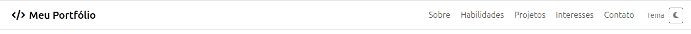

### Criar a Seção de Informações Básicas da Página

Nessa etapa, iremos criar uma seção de informações básicas em nossa página pessoal. Assim, teremos uma foto do perfil e uma pequena biografia do estudante. Além disso, teremos links para projetos, contato, github e linkedin.

**Atualizando o HTML**

Inclua no arquivo `index.html` o conteúdo abaixo. Atencão: O código abaixo deve ser colocado logo após o fim da tag *nav* e acima do script javascript.

```html
<!-- Header / Informações Básicas -->
<header id="top" class="py-5">
    <div class="container">
        <div class="row align-items-center g-4">
            <div class="col-12 col-lg-4 text-center">
                
                <div class="mt-3">
                    <span class="badge text-bg-primary me-1">Sistemas de Informação</span>
                    <span class="badge text-bg-secondary">UFLA</span>
                </div>
            </div>
            <div class="col-12 col-lg-8">
                <h1 class="display-6 fw-semibold mb-3">
                    Olá! Eu sou <span class="text-primary">Nome do Estudante</span>
                </h1>
                <p class="lead text-secondary mb-4">
                    Estudante do curso de Sistemas de Informação, interessado em desenvolvimento web e em aprender mais sobre tecnologias e computação.
                </p>
                <div class="d-flex flex-wrap gap-2">
                    <a class="btn btn-primary" href="#projetos">
                        <i class="fa-solid fa-diagram-project me-2"></i>Ver projetos
                    </a>
                    <a class="btn btn-outline-primary" href="#contato">
                        <i class="fa-solid fa-envelope me-2"></i>Contato
                    </a>
                    <a class="btn btn-outline-secondary" href="https://github.com/" target="_blank">
                        <i class="fa-brands fa-github me-2"></i>GitHub
                    </a>
                    <a class="btn btn-outline-secondary" href="https://www.linkedin.com/" target="_blank">
                        <i class="fa-brands fa-linkedin me-2"></i>LinkedIn
                    </a>
                </div>
                <hr class="my-4">
                <div class="row g-3">
                    <div class="col-12 col-md-6">
                        <div class="p-3 rounded-3 border bg-body-tertiary">
                            <div class="d-flex align-items-center gap-2 mb-2">
                                <i class="fa-solid fa-graduation-cap text-primary"></i>
                                <strong>Curso</strong>
                            </div>
                            <p class="mb-0 text-secondary">
                                Bacharelado em Sistemas de Informação - Universidade Federal de Lavras (UFLA).
                            </p>
                        </div>
                    </div>
                    <div class="col-12 col-md-6">
                        <div class="p-3 rounded-3 border bg-body-tertiary">
                            <div class="d-flex align-items-center gap-2 mb-2">
                                <i class="fa-solid fa-bullseye text-primary"></i>
                                <strong>Objetivo</strong>
                            </div>
                            <p class="mb-0 text-secondary">
                                Aprimorar habilidades em web (front-end e back-end) e participar de projetos práticos no semestre.
                            </p>
                        </div>
                    </div>
                </div>
            </div>
        </div>
    </div>
</header>
```

Em seguida, copie o arquivo `foto.svg` que está na pasta `aula-bootstrap/docs` para a pasta `code/assets/img`.

**Explicação sobre o código Bootstrap**

* `py-5`: padding vertical grande (topo e base).
* `row`: informações em linha.
* `col-12`: ocupa 100% no mobile.
* `col-lg-4` / `col-lg-8`: em telas grandes divide em 4/8 colunas.
* `g-4`: "gap" do grid (espaçamento entre colunas).
* `align-items-center`: alinha verticalmente os itens no centro.
* `text-center`: centraliza texto.
* `shadow-sm`: sombra leve (para destacar a imagem).
* `badge`: etiqueta.
* `text-bg-primary`: badge com fundo na cor primária e texto adequado.
* `me-1`: margin-end (direita) 1 (espaço entre badges).
* `display-6`: tamanho de título grande e padronizado.
* `lead`: parágrafo com destaque.
* `d-flex flex-wrap gap-2`: botões em linha, quebrando quando faltar espaço e com espaçamento.
* `my-4`: margem vertical (topo e base).
* `col-md-6`: 50% da largura em telas médias ou maiores.
* `p-3`: espaçamento interno.
* `rounded-3`: bordas arredondadas.
* `border`: borda padrão.
* `bg-body-tertiary`: fundo suave adaptável ao tema.
* `gap-2`: espaço entre ícone e texto.
* `mb-2`: margem inferior.
* `mb-0`: remove margem padrão do parágrafo.

Abra a aplicação no navegador e analise o resultado. O resultado deverá se assemelhar à imagem abaixo:

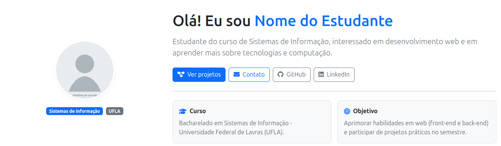

### Criar a Seção de Sobre da Página

Nessa etapa, iremos criar uma seção de sobre em nossa página pessoal. Assim, teremos uma pequena biografia do estudante e algumas informações rápidas sobre a cidade, idioma e a área de interesse.

**Atualizando o HTML**

Inclua no arquivo `index.html` o conteúdo abaixo. Atencão: O código abaixo deve ser colocado logo após o fim da tag *header* e acima do script javascript.

```html
<main class="pb-5">
    <!-- Sobre -->
    <section id="sobre" class="py-4">
        <div class="container">
            <div class="mb-3">
                <h2 class="h4 mb-1">Sobre</h2>
                <p class="text-secondary mb-0">Uma breve descrição do estudante e trajetória.</p>
            </div>
            <div class="row g-4">
                <div class="col-12 col-lg-7">
                    <div class="card shadow-sm">
                        <div class="card-body">
                            <p class="mb-2">
                                Sou estudante de Sistemas de Informação e gosto de construir aplicações web e aprender criando projetos.
                            </p>
                            <p class="mb-0 text-secondary">
                                Nesta página, apresento minhas habilidades, interesses e projetos desenvolvidos.
                            </p>
                        </div>
                    </div>
                </div>
                <div class="col-12 col-lg-5">
                    <div class="card shadow-sm">
                        <div class="card-body">
                            <h3 class="h6 mb-3">Informações rápidas</h3>
                            <ul class="list-unstyled mb-0">
                                <li class="d-flex gap-2 mb-2">
                                    <i class="fa-solid fa-location-dot text-primary mt-1"></i>
                                    <div><strong>Cidade:</strong> Lavras/MG</div>
                                </li>
                                <li class="d-flex gap-2 align-items-start mb-2">
                                    <i class="fa-solid fa-language mt-1 text-primary"></i>
                                    <div><strong>Idiomas:</strong> Português, Inglês (intermediário)</div>
                                </li>
                                <li class="d-flex gap-2">
                                    <i class="fa-solid fa-laptop-code text-primary mt-1"></i>
                                    <div><strong>Área:</strong> Desenvolvimento Web</div>
                                </li>
                            </ul>
                        </div>
                    </div>
                </div>
            </div>
        </div>
    </section>
</main>
```

**Explicação sobre o código Bootstrap**

* `pb-5`: padding-bottom para dar "respiro" no final.
* `py-4`: padding vertical médio nas seções.
* `h4, h6`: classes de tipografia do Bootstrap (tamanhos padronizados).
* `card`: componente visual para agrupar conteúdo.
* `card-body`: padding interno do card.
* `list-unstyled`: remove marcadores e recuo padrão da lista.
* `d-flex gap-2`: lista com ícone e texto em linha, com espaçamento.
* `mt-1`: leve margin-top para alinhar o ícone ao texto.

Abra a aplicação no navegador e analise o resultado. O resultado deverá se assemelhar à imagem abaixo:

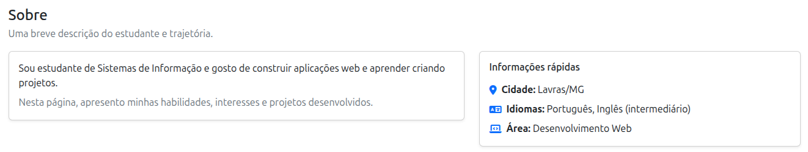

### Criar a Seção de Habilidades da Página

Nessa etapa, iremos criar uma seção de habilidades em nossa página pessoal. Aqui, teremos dois cards principais: um com as tecnologias e outro com o nível de familiaridade.

**Atualizando o HTML**

Inclua no arquivo `index.html` o conteúdo abaixo. Atencão: O código abaixo deve ser colocado logo após o fim da tag *section* (do sobre) e antes do fim da tag *main*.

```html
<!-- Habilidades -->
<section id="habilidades" class="py-4">
    <div class="container">
        <div class="section-title">
            <h2 class="h4 mb-1">Habilidades</h2>
            <p class="text-secondary mb-0">Tecnologias e competências.</p>
        </div>
        <div class="row g-4 mt-1">
            <div class="col-12 col-lg-6">
                <div class="card shadow-sm h-100">
                    <div class="card-body">
                        <h3 class="h6">Tecnologias</h3>
                        <div class="d-flex flex-wrap gap-2">
                            <span class="badge rounded-pill text-bg-primary">HTML</span>
                            <span class="badge rounded-pill text-bg-primary">CSS</span>
                            <span class="badge rounded-pill text-bg-primary">JavaScript</span>
                            <span class="badge rounded-pill text-bg-secondary">Bootstrap</span>
                            <span class="badge rounded-pill text-bg-secondary">Git/GitHub</span>
                            <span class="badge rounded-pill text-bg-secondary">Python</span>
                            <span class="badge rounded-pill text-bg-secondary">Django</span>
                        </div>
                        <hr>
                        <h3 class="h6">Competências</h3>
                        <ul class="mb-0">
                            <li>Construção de páginas responsivas</li>
                            <li>Manipulação do DOM e eventos</li>
                            <li>Organização de projetos e versionamento</li>
                            <li>Boas práticas de legibilidade de código</li>
                        </ul>
                    </div>
                </div>
            </div>
            <div class="col-12 col-lg-6">
                <div class="card shadow-sm h-100">
                    <div class="card-body">
                        <h3 class="h6">Nível de familiaridade (exemplo)</h3>
                        <div class="mb-3">
                            <div class="d-flex justify-content-between">
                                <span>HTML</span><span class="text-secondary small">Intermediário</span>
                            </div>
                            <div class="progress" role="progressbar" aria-label="HTML" aria-valuenow="70" aria-valuemin="0" aria-valuemax="100">
                                <div class="progress-bar" style="width: 70%"></div>
                            </div>
                        </div>
                        <div class="mb-3">
                            <div class="d-flex justify-content-between">
                                <span>CSS</span><span class="text-secondary small">Básico-Intermediário</span>
                            </div>
                            <div class="progress" role="progressbar" aria-label="CSS" aria-valuenow="55" aria-valuemin="0" aria-valuemax="100">
                                <div class="progress-bar" style="width: 55%"></div>
                            </div>
                        </div>
                        <div class="mb-0">
                            <div class="d-flex justify-content-between">
                                <span>JavaScript</span><span class="text-secondary small">Intermediário</span>
                            </div>
                            <div class="progress" role="progressbar" aria-label="JavaScript" aria-valuenow="65" aria-valuemin="0" aria-valuemax="100">
                                <div class="progress-bar" style="width: 65%"></div>
                            </div>
                        </div>
                    </div>
                </div>
            </div>
        </div>
    </div>
</section>
```

**Explicação sobre o código Bootstrap**

* `h-100`: faz o card ocupar a altura total da coluna (para alinhar cards lado a lado).
* `badge rounded-pill`: badge com formato de "pílula".
* `flex-wrap`: permite quebrar linha dos badges.

Abra a aplicação no navegador e analise o resultado. O resultado deverá se assemelhar à imagem abaixo:

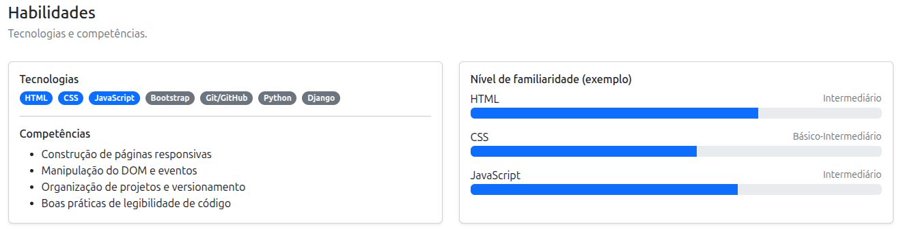

### Criar a Seção de Projetos da Página

Nessa etapa, iremos criar uma seção de projetos em nossa página pessoal. Aqui, teremos três cards principais: um card para cada projeto que já participou.

**Atualizando o HTML**

Inclua no arquivo `index.html` o conteúdo abaixo. Atencão: O código abaixo deve ser colocado logo após o fim da tag *section* (do habilidades) e antes do fim da tag *main*.

```html
<!-- Projetos -->
<section id="projetos" class="py-4">
    <div class="container">
        <div class="section-title">
            <h2 class="h4 mb-1">Projetos</h2>
            <p class="text-secondary mb-0">Alguns trabalhos já desenvolvidos.</p>
        </div>
        <div class="row g-4 mt-1">
            <div class="col-12 col-md-6 col-lg-4">
                <div class="card shadow-sm h-100">
                    <div class="card-body d-flex flex-column">
                        <div class="d-flex align-items-start justify-content-between gap-2">
                            <h3 class="h6 mb-1">Jogo da Velha</h3>
                            <span class="badge text-bg-secondary">HTM</span>
                            <span class="badge text-bg-secondary">CSS</span>
                            <span class="badge text-bg-secondary">JavaScript</span>
                        </div>
                        <p class="text-secondary small">
                            Implementação do jogo com verificação de vitória e reinício.
                        </p>
                        <ul class="small mb-4">
                            <li>Matriz</li>
                            <li>Manipulação do DOM</li>
                            <li>Animação de personagens</li>
                        </ul>
                        <div class="mt-auto d-flex gap-2">
                            <a class="btn btn-sm btn-outline-primary" href="#" target="_blank" rel="noreferrer">
                                <i class="fa-brands fa-github me-1"></i>Repositório
                            </a>
                            <a class="btn btn-sm btn-primary" href="#" target="_blank" rel="noreferrer">
                                <i class="fa-solid fa-arrow-up-right-from-square me-1"></i>Demo
                            </a>
                        </div>
                    </div>
                </div>
            </div>
            <div class="col-12 col-md-6 col-lg-4">
                <div class="card shadow-sm h-100">
                    <div class="card-body d-flex flex-column">
                        <div class="d-flex align-items-start justify-content-between gap-2">
                            <h3 class="h6 mb-1">Página Pessoal</h3>
                            <span class="badge text-bg-secondary">HTML</span>
                            <span class="badge text-bg-secondary">Bootstrap</span>
                            <span class="badge text-bg-secondary">FontAwnsome</span>
                        </div>
                        <p class="text-secondary small">
                            Implementação de página pessoal com seções e navegação.
                        </p>
                        <ul class="small mb-4">
                            <li>Classes do Bootstrap</li>
                            <li>Grid do Bootstrap</li>
                            <li>Componentes (cards, navbar)</li>
                        </ul>
                        <div class="mt-auto d-flex gap-2">
                            <a class="btn btn-sm btn-outline-primary" href="#" target="_blank" rel="noreferrer">
                                <i class="fa-brands fa-github me-1"></i>Repositório
                            </a>
                            <a class="btn btn-sm btn-primary" href="#" target="_blank" rel="noreferrer">
                                <i class="fa-solid fa-arrow-up-right-from-square me-1"></i>Demo
                            </a>
                        </div>
                    </div>
                </div>
            </div>
            <div class="col-12 col-md-6 col-lg-4">
                <div class="card shadow-sm h-100">
                    <div class="card-body d-flex flex-column">
                        <div class="d-flex align-items-start justify-content-between gap-2">
                            <h3 class="h6 mb-1">Calculadora Web</h3>
                            <span class="badge text-bg-secondary">Front-end</span>
                        </div>
                        <p class="text-secondary small">
                            Calculadora com operações básicas e interface responsiva.
                        </p>
                        <ul class="small mb-4">
                            <li>HTML + CSS</li>
                            <li>JavaScript</li>
                            <li>Eventos e DOM</li>
                        </ul>
                        <div class="mt-auto d-flex gap-2">
                            <a class="btn btn-sm btn-outline-primary" href="#" target="_blank" rel="noreferrer">
                                <i class="fa-brands fa-github me-1"></i>Repositório
                            </a>
                            <a class="btn btn-sm btn-primary" href="#" target="_blank" rel="noreferrer">
                                <i class="fa-solid fa-arrow-up-right-from-square me-1"></i>Demo
                            </a>
                        </div>
                    </div>
                </div>
            </div>
        </div>
    </div>
</section>
```

**Explicação sobre o código Bootstrap**

* `row g-4` dentro do card: cria uma "sub-grade" para listar projetos.
* `col-md-6`: em telas médias, mostra 2 projetos por linha.
* `border rounded-3 p-3`: "mini-card" sem usar componente card completo.
* `small`: tipografia menor.
* `btn-sm`: botão pequeno.

Abra a aplicação no navegador e analise o resultado. O resultado deverá se assemelhar à imagem abaixo:

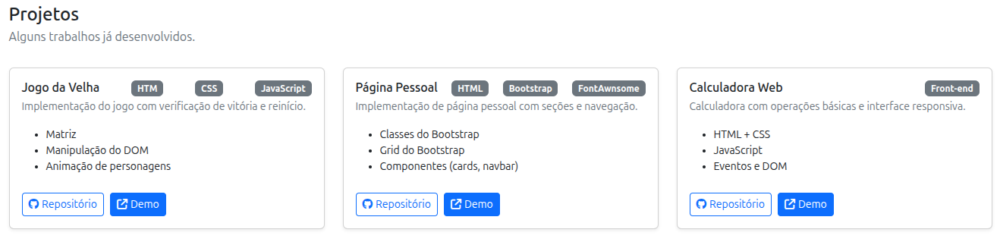

### Criar a Seção de Interesses da Página

Nessa etapa, iremos criar uma seção de interesses em nossa página pessoal. Aqui, teremos dois cards principais para destacar os interesses.

**Atualizando o HTML**

Inclua no arquivo `index.html` o conteúdo abaixo. Atencão: O código abaixo deve ser colocado logo após o fim da tag *section* (do projetos) e antes do fim da tag *main*.

```html
<!-- Interesses -->
<section id="interesses" class="py-4">
    <div class="container">
        <div class="section-title">
            <h2 class="h4 mb-1">Interesses</h2>
            <p class="text-secondary mb-0">Áreas que eu gosto de estudar/pesquisar.</p>
        </div>
        <div class="row g-4 mt-1">
            <div class="col-12 col-lg-6">
                <div class="card shadow-sm h-100">
                    <div class="card-body">
                        <ul class="mb-0">
                        <li>Desenvolvimento Web (Front-end e Back-end)</li>
                        <li>Banco de Dados e modelagem</li>
                        <li>Algoritmos e estruturas de dados</li>
                        <li>Engenharia de Software</li>
                        <li>Dados e visualização</li>
                        </ul>
                    </div>
                </div>
            </div>
            <div class="col-12 col-lg-6">
                <div class="card shadow-sm h-100">
                    <div class="card-body">
                        <h3 class="h6">Atividades</h3>
                        <p class="text-secondary mb-2">
                            Participo de projetos acadêmicos e gosto de aprender criando coisas.
                        </p>
                        <div class="d-flex flex-wrap gap-2">
                            <span class="badge text-bg-light border"><i class="fa-solid fa-book me-1"></i>Estudos</span>
                            <span class="badge text-bg-light border"><i class="fa-solid fa-people-group me-1"></i>Trabalho em equipe</span>
                            <span class="badge text-bg-light border"><i class="fa-solid fa-terminal me-1"></i>Projetos práticos</span>
                        </div>
                    </div>
                </div>
            </div>
        </div>
    </div>
</section>
```

**Explicação sobre o código Bootstrap**

* 

Abra a aplicação no navegador e analise o resultado. O resultado deverá se assemelhar à imagem abaixo:

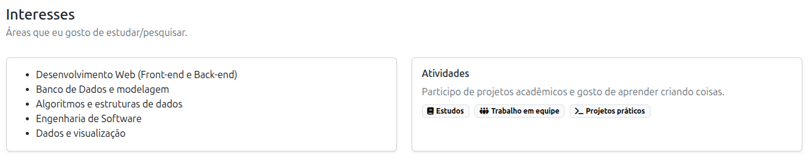

### Criar a Seção de Contato da Página

Nessa etapa, iremos criar uma seção de contato em nossa página pessoal. Aqui, teremos dois cards principais para destacar as informações de contato.

**Atualizando o HTML**

Inclua no arquivo `index.html` o conteúdo abaixo. Atencão: O código abaixo deve ser colocado logo após o fim da tag *section* (do interesses) e antes do fim da tag *main*.

```html
<!-- Contato -->
<section id="contato" class="py-4">
    <div class="container">
        <div class="section-title">
            <h2 class="h4 mb-1">Contato</h2>
            <p class="text-secondary mb-0">Como falar comigo.</p>
        </div>
        <div class="row g-4 mt-1">
            <div class="col-12 col-lg-6">
                <div class="card shadow-sm">
                    <div class="card-body">
                        <ul class="list-unstyled mb-0">
                            <li class="d-flex gap-2 align-items-center mb-2">
                                <i class="fa-solid fa-envelope text-primary"></i>
                                <span>email@exemplo.com</span>
                            </li>
                            <li class="d-flex gap-2 align-items-center mb-2">
                                <i class="fa-brands fa-github text-primary"></i>
                                <a class="link-underline link-underline-opacity-0" href="https://github.com/" target="_blank" rel="noreferrer">
                                    github.com/seu-usuario
                                </a>
                            </li>
                            <li class="d-flex gap-2 align-items-center">
                                <i class="fa-brands fa-linkedin text-primary"></i>
                                <a class="link-underline link-underline-opacity-0" href="https://www.linkedin.com/" target="_blank" rel="noreferrer">
                                    linkedin.com/in/seu-usuario
                                </a>
                            </li>
                        </ul>
                    </div>
                </div>
            </div>
            <div class="col-12 col-lg-6">
                <div class="card shadow-sm">
                    <div class="card-body">
                        <ul class="list-unstyled mb-0">
                            <li class="d-flex gap-2 align-items-center mb-2">
                                <i class="fa-brands fa-instagram text-primary"></i>
                                <a class="link-underline link-underline-opacity-0" href="https://instagram.com/" target="_blank" rel="noreferrer">
                                    instagram.com/seu-usuario
                                </a>
                            </li>
                            <li class="d-flex gap-2 align-items-center mb-2">
                                <i class="fa-brands fa-facebook text-primary"></i>
                                <a class="link-underline link-underline-opacity-0" href="https://facebook.com/" target="_blank" rel="noreferrer">
                                    facebook.com/seu-usuario
                                </a>
                            </li>
                            <li class="d-flex gap-2 align-items-center">
                                <i class="fa-brands fa-youtube text-primary"></i>
                                <a class="link-underline link-underline-opacity-0" href="https://www.youtube.com/" target="_blank" rel="noreferrer">
                                    youtube.com/seu-usuario
                                </a>
                            </li>
                        </ul>
                    </div>
                </div>
            </div>
        </div>
    </div>
</section>
```

**Explicação sobre o código Bootstrap**

* 

Abra a aplicação no navegador e analise o resultado. O resultado deverá se assemelhar à imagem abaixo:

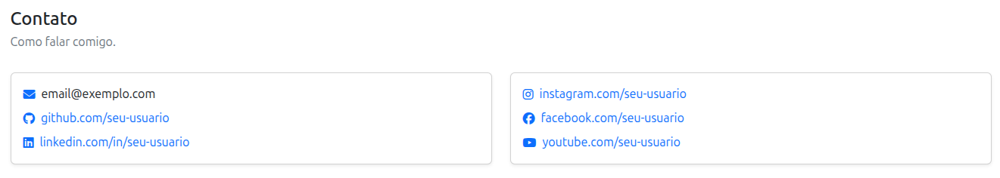

### Criar o Rodapé da Página

Nessa etapa, iremos criar um rodapé para em nossa página pessoal.

**Atualizando o HTML**

Inclua no arquivo `index.html` o conteúdo abaixo. Atencão: O código abaixo deve ser colocado logo após o fim da tag *main* e antes da inclusão do script javascript.

```html
<!-- Rodapé da Página -->
<footer class="border-top py-4">
    <div class="container d-flex flex-column flex-md-row justify-content-between gap-2">
        <small class="text-secondary">© <span id="year"></span> Página Pessoal — Nome do Estudante</small>
        <small class="text-secondary">Feito com HTML + Bootstrap + um pouco de CSS/JS</small>
    </div>
</footer>
```

**Explicação sobre o código Bootstrap**

* 

Abra a aplicação no navegador e analise o resultado. O resultado deverá se assemelhar à imagem abaixo:

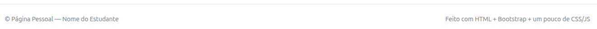

### Criar CSS Externo para Ajustes Finos

Nesta etapa, iremos criar um arquivo CSS externo para realizar ajustes finos, como ajuste no tamanho da imagem e ajuste para evitar que título fique escondido pela navbar fixa.

**Criando o arquivo CSS**

Para isso, crie um arquivo chamado `styles.css` na pasta `code/assets/css/` e coloque o seguinte conteúdo:

```css
/* Ajusta tamanho da imagem de perfil */
.profile-img {
    width: 160px;
    height: 160px;
    border-radius: 999px;
    border: 4px solid rgba(255, 255, 255, 0.7);
}

/* Melhorar espaçamento do âncora/título (por causa da navbar fixa) */
section {
    scroll-margin-top: 90px;
}
```

Abra a aplicação no navegador e analise o resultado.

### Criar JavaScript Externo para Ajustar Tema

Nesta etapa, iremos criar um arquivo JavaScript externo para realizar o ajuste no tema (claro/escuro).

**Criando o arquivo JavaScript**

Para isso, crie um arquivo chamado `script.js` na pasta `code/assets/js/` e coloque o seguinte conteúdo:

```javascript
// Seleciona elementos
var root = document.documentElement;
var btn = document.getElementById("themeToggle");

// Função para aplicar o tema
function applyTheme(theme) {
    // Define o tema no HTML
    root.setAttribute("data-bs-theme", theme);
    // Salva no localStorage
    localStorage.setItem("theme", theme);
    // Se o botão existir, atualiza o ícone
    if (btn) {
        if (theme === "dark") {
            btn.innerHTML = '<i class="fa-solid fa-sun"></i>';
        } else {
            btn.innerHTML = '<i class="fa-solid fa-moon"></i>';
        }
    }
}

// Verifica se já existe tema salvo
var savedTheme = localStorage.getItem("theme");

if (savedTheme) {
    applyTheme(savedTheme);
} else {
    applyTheme("light");
}

// Evento de clique no botão
if (btn) {
    btn.addEventListener("click", function () {
        var currentTheme = root.getAttribute("data-bs-theme");
        if (currentTheme === "light") {
            applyTheme("dark");
        } else {
            applyTheme("light");
        }
    });
}
```

O Bootstrap 5.3 entende o atributo `data-bs-theme` e troca as cores automaticamente. Você não precisa reescrever CSS inteiro para o modo escuro, só pequenos ajustes.

Abra a aplicação no navegador e analise o resultado. O resultado deverá se assemelhar às imagens abaixo:

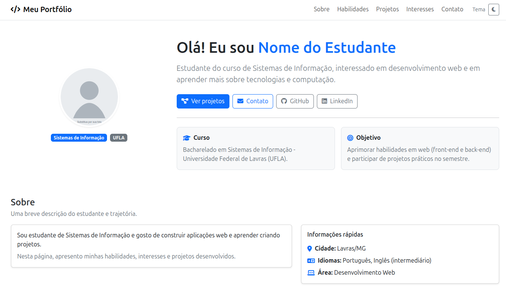
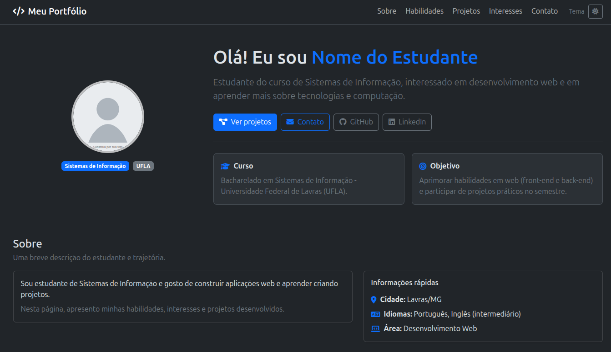

### Publicar a Página no Github

Para disponibilizar a página desenvolvida no GitHub Pages, siga os passos abaixo:

1. Faça o upload do seu projeto para um repositório no GitHub.

2. Acesse a aba **Settings** do repositório.

3. Clique em **Pages** no menu lateral.

4. Em **Build and deployment**, vá até a opção **Branch**, selecione o branch `main` e clique em **Save**.

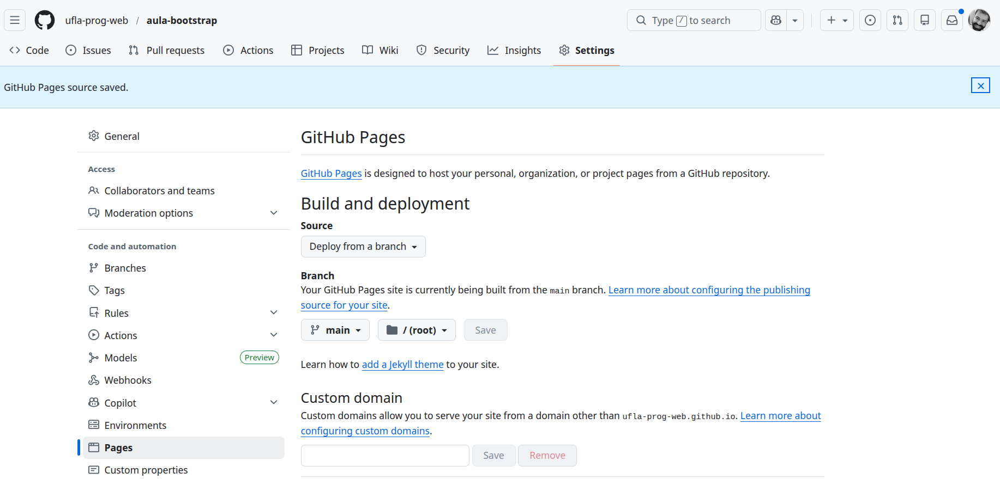

Após a configuração, o GitHub Pages gerará um link onde a página poderá ser acessada online.

### Atividades

Agora que você já conhece bem como construir uma página pessoal utilizando HTML e Bootstrap, realize as seguintes ações:

* Coloque informações acadêmicas reais sobre você.
* Publique a sua página pessoal no seu github.
* Desenvolva a mesma página web utilizando um outro framework CSS.
* Analise as diferenças entre os frameworks CSS utilizados.

## Desenvolva Novos Projetos

<a href="#índice"></a>

Com os conhecimentos adquiridos em Boostrap, desenvolva novos projetos para praticar e consolidar o aprendizado:

* Desenvolva uma página estática para um **restaurante**.
* Desenvolva uma página estática para uma **lanchonete**.
* Desenvolva uma página estática para uma **academia**.

## Créditos e Referências

<a href="#índice"></a>

Para aprofundar os estudos sobre Bootstrap, recomenda-se a consulta ao seguinte curso:

* [Curso de Bootstrap - W3Schools](https://www.w3schools.com/bootstrap5/index.php)
